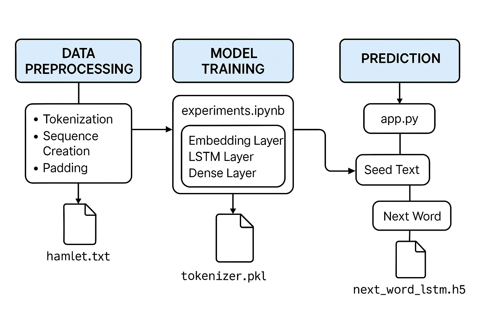
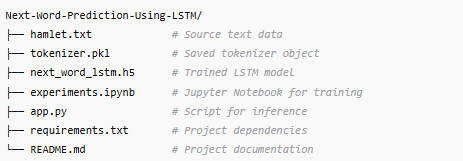

# Next Word Prediction Using LSTM-RNN

This project implements a next-word prediction model using **Long Short-Term Memory (LSTM) neural networks**. The project includes components for data preprocessing, model training, and inference.

### 🧠 Project Architecture Overview
The project's workflow can be broken down into the following stages:

  

#### 1. Data Ingestion & Preprocessing

- Input: hamlet.txt – a plain text file containing Shakespeare's Hamlet.

- Processing Steps:

    - Tokenization of the text corpus.

    - Creation of input sequences for training.

    - Padding sequences to ensure uniform length.

    - Saving the tokenizer object as tokenizer.pkl for future use.

#### 2. Model Development & Training

- Script: experiments.ipynb

- Model Architecture:

    - Embedding layer to convert words into vector representations.

    - LSTM layer(s) to capture temporal dependencies.

    - Dense output layer with softmax activation for predicting the next word.

- Training:

    - Model is trained on the preprocessed sequences.

    - Trained model is saved as next_word_lstm.h5.

#### 3. Inference & Deployment

- Script: app.py

- Functionality:

    - Loads the trained model and tokenizer.

    - Accepts user input (seed text).

    - Processes input to predict and display the next word.

### 📁 Repository Structure

### 🔧 Technologies & Libraries

- Programming Language: Python

- Libraries:

    - TensorFlow & Keras – for building and training the neural network.

    - NumPy – for numerical operations.

    - Pickle – for saving and loading the tokenizer.

    - Streamlit (if used) – for creating a web interface.

### 🧩 Step-by-Step Commands to run it locally

#### 1. Clone the GitHub repo
`git clone https://github.com/anulsasidharan/Next-Word-Prediction-Using-LSTM.git`

`cd Next-Word-Prediction-Using-LSTM`

#### 2. Create and activate a virtual environment (optional but recommended)
`python -m venv venv`
#### On Windows:
`venv\Scripts\activate`
#### On macOS/Linux:
`source venv/bin/activate`

#### 3. Install dependencies
`pip install -r requirements.txt`

#### 4. (Optional) Run the Jupyter Notebook for training
`jupyter notebook experiments.ipynb`

#### 5. Run the prediction app
`streamlit run app.py`
